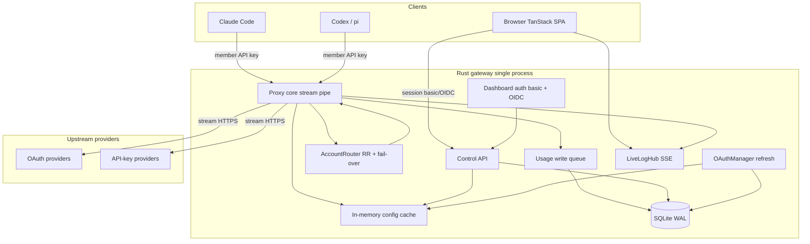

> **Moved to** [`investtal/agi`](https://github.com/investtal/agi) (AI Gateway Investtal). This copy is retained for history; edit the agi repo.

# Team AI Gateway — Design Spec

**Status:** Draft (awaiting human approval / Plannotator)  
**Date:** 2026-08-03  
**Product name (working):** Team AI Gateway (greenfield; 9router-inspired subset)  
**Related:** Replaces day-to-day team use of 9router for Claude Code / Codex / pi on a shared VPS.

---

## 1. Purpose

Build a **shared team AI gateway** optimized for **proxy hot-path latency and reliability under heavy concurrent load** (15+ people / many parallel agents). Expose a slim feature set: member keys, OAuth + API-key providers, round-robin + fail-over routing, usage/quota/live logs, portable backup, dashboard auth (basic + OIDC), and basic RBAC.

This is **not** full 9router feature parity. Node/9router is treated as reference behavior only.

---

## 2. Context

- Today the team runs **9router** (Node / vinext + SQLite) as a shared OpenAI-compatible router for Codex, Claude Code, pi, and similar tools.
- Primary pain: **latency and reliability of the shared proxy hop** under real team + agent load — not dashboard ownership alone.
- Observed risk: Node stack + possible buffering / heavy middleware can inflate hop latency; provider RTT still dominates generation, but **gateway-added** latency and stream stalls are in scope.
- Rebuild target: **Rust** control plane + proxy; **TanStack React** dashboard. Single process, single VPS, portable data directory.

---

## 3. Constraints

| ID | Constraint |
|----|------------|
| C1 | Shared gateway deploy (one team instance), design for **heavy** concurrency |
| C2 | Day-one clients: **Claude Code**, **Codex**, **pi** |
| C3 | Proxy/control language: **Rust**; UI: **TanStack React (Router)** |
| C4 | Evaluate **Pingora vs axum/hyper** via spike; default path **axum/hyper** until spike says otherwise |
| C5 | Member identity for usage: **one gateway API key per person/agent** |
| C6 | Routing default: **round-robin**; **fail-over** on 429 / selected 5xx / failed OAuth after refresh |
| C7 | Secrets: manage in product; **no encrypt-at-rest required in v1**; **member API keys hashed at rest** (prefix display only) |
| C8 | Portability: VPS move via **DB file + JSON bundle** import/export (providers, OAuth tokens, keys metadata, settings, usage) |
| C9 | Dashboard auth: **basic username/password default**; **OIDC (Keycloak)** optional; roles **viewer** (all dashboard read) / **admin** (secrets & key management) |
| C10 | Out of v1: RTK token compression, MITM, multi-tier product fallback chains, media providers, MCP, tunnels, multi-replica active-active |

---

## 4. Success criteria

### Latency / reliability (must measure)

| Metric | Target |
|--------|--------|
| Gateway hop p95 (non-stream, mock upstream) | **&lt; 20ms** added |
| Time-to-first-byte p95 (stream, mock upstream) | **&lt; 10ms** added vs direct mock |
| Gateway-added TTFT p99 | **&lt; 50ms** |
| Stream buffering | **Zero full-body buffer** of request or response |
| Heavy concurrent | **15+ parallel streams** without multi-second stalls or freezes |

### Product

- [ ] Admin can connect OAuth providers (Claude Code, Antigravity, OpenAI Codex, xAI/Grok, Kimi) with auto refresh
- [ ] Admin can connect API-key providers (GLM Coding, Open Model, Alibaba Coding, Anthropic, MiniMax Coding, Kimi, Deepseek)
- [ ] Usage overview: requests, input / cached / output tokens, estimated cost; ranges **today, 3d, 7d, 30d, 90d**
- [ ] Filters: member, model, tool/client, status, time; recent request detail
- [ ] Per-member usage (via member API keys) including models
- [ ] Quota tracker per OAuth/API-key account (as available from provider or derived)
- [ ] Realtime console log + filterable recent requests
- [ ] Import/export DB + provider bundle
- [ ] Basic auth + optional Keycloak OIDC; viewer vs admin enforcement
- [ ] Round-robin + fail-over routing

---

## 5. Decisions (locked)

| Trade-off | Chosen | Why |
|-----------|--------|-----|
| Primary goal | Hot-path latency + reliability | Stakeholder priority A |
| Deploy | Single shared VPS instance | Team topology |
| Architecture | **Single Rust binary** + TanStack SPA | Lowest ops; one data dir; one port story |
| Language | **Rust** proxy/control | Mature async HTTP, streaming, OAuth/JWT/SQL crates; Pingora proof-point at scale |
| Not Zig / C for v1 | Deferred | Zig async/HTTP still maturing; C high safety cost for OAuth product |
| HTTP stack default | **axum + hyper + tokio** | Cohesive admin API + proxy; team-friendly |
| Pingora | **Spike-gated** alternative | Use only if concurrent SSE + multi-upstream filters clearly win p95/p99 |
| Storage | **SQLite WAL** + single async write queue | Portability + enough write throughput if batched; multi-writer Postgres later if multi-instance |
| Member attribution | Per-member gateway API keys | Clear cost/usage ownership |
| Key at rest | **Hash** member keys (argon2/bcrypt); store provider secrets as config secrets without app-level encrypt-at-rest | Safety without full KMS |
| Scope extras | No RTK/MITM/multi-tier; **yes** simple fail-over | YAGNI + uptime |
| Dashboard stack | TanStack React Router SPA | Stakeholder lock |
| 9router | Reference only; no dual-stack long term | Clean product boundary |

---

## 6. Architecture



### Process units

| Unit | Does | Depends on | Must not |
|------|------|------------|----------|
| Proxy core | Member key auth, pick account, stream, fail-over, enqueue usage | Cache, UpstreamClient | Full-body buffer; sync SQLite write |
| Control API | CRUD providers/keys/users, usage queries, import/export | SQLite, cache invalidate | Touch stream bodies |
| Auth | Basic + OIDC; viewer/admin | Settings | Gate LLM traffic (member keys do) |
| OAuthManager | Connect + refresh tokens | Provider modules, SQLite | Block proxy event loop |
| Usage writer | Batch inserts | Single SQLite writer connection | Multi-writer contention |
| TanStack SPA | UI | Control API + SSE | Long-term secret storage in localStorage |

### Deploy

- One binary; data dir e.g. `./data/gateway.db`, config, export bundles.
- Health: `/healthz`, `/readyz`.
- VPS migrate: stop → copy `data/` and/or import JSON bundle → start.

---

## 7. Components

### Rust

- **MemberKeyAuth** — validate key → `member_id`
- **AccountRouter** — round-robin cursors per provider pool; skip disabled/exhausted; fail-over
- **UpstreamClient** — streaming HTTP; inject credentials
- **ProtocolAdapter** — OpenAI-compatible `/v1/*` + Anthropic Messages as required by Claude Code
- **OAuthManager** — Claude Code, Antigravity, Codex, xAI, Kimi (+ refresh)
- **ProviderRegistry** — OAuth + API-key provider configs
- **UsageRecorder** — non-blocking channel → batch writer
- **QuotaTracker** — per-account quota snapshots
- **LiveLogHub** — ring buffer + SSE fan-out
- **ExportImport** — DB download + JSON bundle (admin)
- **DashboardAuth** — basic default, OIDC Keycloak, roles

### TanStack SPA

- Login (basic / OIDC)
- Usage overview + filters + request detail
- Members tab (per key / model)
- Providers + quota
- Live console + recent requests
- Admin: secrets, member keys, users, import/export

---

## 8. Data access patterns → representation

### Access-pattern card

| Rank | Access | Volume (heavy) | Latency | Representation |
|------|--------|----------------|---------|----------------|
| 1 | Read key → member, provider account pool | Every LLM request | &lt;1ms | **In-memory cache**; SQLite SoT on mutate |
| 2 | Append request log | End of each request/stream | Non-blocking | **mpsc + batch INSERT** single writer |
| 3 | List recent requests + filters | UI | &lt;100ms | Row table + indexes |
| 4 | Aggregates by range | UI | &lt;200ms | SQL aggregate v1; rollups later if needed |
| 5 | Member × model breakdown | UI | &lt;200ms | Group-by on logs |
| 6 | Export/import | Rare | Seconds OK | File + JSON |
| 7 | OAuth token update | Low | Off hot path | Row update + cache bust |

### Logical schema (entities)

- `users` — dashboard identity, `role` ∈ {viewer, admin}, password hash or OIDC subject
- `member_api_keys` — `id`, `name`, `key_prefix`, `key_hash`, `created_at`, `revoked_at`
- `providers` / `accounts` — type oauth|api_key, credentials, quota fields, enabled
- `request_logs` — member_id, provider, account_id, model, prompt/completion/cached tokens, cost_est, status, latency_ms, ttft_ms, tool, created_at, usage_incomplete
- `settings` — auth mode, oidc endpoints, RR flags

### Indexes (minimum)

- `request_logs(created_at)`
- `request_logs(member_id, created_at)`
- `request_logs(model, created_at)`
- `request_logs(status, created_at)`

### SQLite vs Postgres (locked for v1)

**SQLite WAL** on a single node with:

1. One dedicated writer task for logs  
2. Memory cache for routing  
3. Full file download + JSON export for disaster recovery  

**Postgres** deferred until multi-instance gateway is a real requirement.

### QC gates (data)

- Import rejects invalid bundles (no half-applied state).
- Disk/SQLite write failure must not drop live streams (log metric + drop/spill batch).
- Redact secrets in all logs.

### Lineage

- Each `request_logs.id` is the lineage id for a proxied call; live console events reference the same id when available.

---

## 9. Data flows

### Hot path (LLM)

1. Authenticate member key → `member_id`  
2. Resolve model → provider pool  
3. `AccountRouter.pick()` (round-robin)  
4. Attach credentials (API key or OAuth access token)  
5. Refresh token if needed (prefer background; on-demand if expired)  
6. Stream request/response (no full-body buffer)  
7. On 429 / selected 5xx / post-refresh 401 → fail-over next account (bounded); **no mid-body account switch after first response byte**  
8. Enqueue usage + live log event  

### OAuth refresh

Background ticker + on-demand; update SQLite; invalidate cache.

### Dashboard usage

`GET /api/usage?range=&member=&model=&tool=&status=` → aggregates + detail endpoints.

### Live console

`GET /api/logs/stream` SSE from LiveLogHub.

### Export / import (admin)

- Download `gateway.db`  
- Download/upload JSON bundle: providers, OAuth tokens, member key **hashes/metadata** (re-issue plaintext keys only if export includes recovery secrets policy — default: export hashes + admin must re-issue member keys unless secrets export is explicitly enabled), settings  
- **Policy lock:** Full disaster recovery includes **encrypted or admin-gated secrets export** optional flag; minimum viable is DB file copy on trusted VPS filesystem.

---

## 10. Error handling

| Case | Response |
|------|----------|
| Bad member key | 401 |
| No account in pool | 400/404 clear error |
| Upstream 429/5xx | Fail-over; if exhausted return last error |
| OAuth 401 | Refresh once → retry; else fail-over |
| Client disconnect | Cancel upstream; partial usage if known |
| After first byte | Do not silent fail-over; end stream cleanly |
| Viewer mutates secrets | 403 |
| Import invalid | Reject all |
| SQLite busy / disk full | Writer backoff; proxy continues; alert |

Secrets never appear in error bodies or structured logs.

---

## 11. Auth & permissions

| Surface | Mechanism |
|---------|-----------|
| LLM `/v1/*` | Member API key only |
| Dashboard + control API | Session: **basic auth default** or **OIDC Keycloak** |
| Role viewer | Read all usage, logs, quotas, providers (redacted secrets) |
| Role admin | Create/revoke member keys, edit provider secrets, import/export, user admin |

---

## 12. Protocol surface (day one)

Must work with:

- **Codex / pi:** OpenAI-compatible base URL (`/v1/chat/completions`, related `/v1/*` as required)
- **Claude Code:** Anthropic-compatible and/or OpenAI-compatible mode as documented in implementation plan matrix

Exact path matrix is an implementation checklist; no commitment to full multi-format 9router coverage.

---

## 13. Pingora vs axum/hyper (evaluation plan — lock after spike)

| Criterion | axum/hyper | Pingora |
|-----------|------------|---------|
| Admin REST + OAuth callbacks | Natural | Awkward fit |
| Streaming reverse proxy | Excellent (DIY pipe) | Excellent (filter model) |
| Team familiarity | Higher | Lower |
| Latency under 50 concurrent SSE | Spike measures | Spike measures |

**Default:** implement on **axum/hyper**.  
**Spike:** same mock workload; record TTFB p95/p99, CPU, memory; write ADR `docs/adr/YYYY-MM-DD-proxy-http-stack.md`.  
**Switch to Pingora only if** spike shows clear win on p95/p99 **or** simpler multi-upstream fail-over without regressions on admin UX.

---

## 14. Testing strategy

| Layer | Coverage |
|-------|----------|
| Unit | RR, fail-over caps, key hash, cost math, ranges |
| Protocol | OpenAI + Anthropic stream fixtures |
| Integration | Mock upstream SSE passthrough; no full buffer; concurrent streams |
| Authz | Viewer vs admin; member key cannot admin |
| Usage | Channel → SQLite → filters/aggregates |
| OAuth | Mock refresh |
| Import/export | Round-trip |
| SLO smoke | Mock concurrent streams; record hop metrics |
| SPA | Thin e2e later: login, usage filter, admin key |

**DoD latency:** automated mock passthrough + documented smoke against targets.

---

## 15. Non-goals (v1)

- RTK / tool_result compression  
- MITM / system proxy  
- Multi-tier subscription→cheap→free product logic beyond per-provider RR + fail-over  
- Multi-region / multi-replica  
- Encrypt-at-rest KMS  
- Full 9router provider catalog parity beyond listed OAuth + API-key set  
- Zig/C rewrite of proxy  

---

## 16. Risks

| Risk | Mitigation |
|------|------------|
| OAuth reverse-engineering breaks | Isolate provider modules; version pins; manual reconnect UX |
| SQLite write bottleneck | Single writer batching; monitor queue depth |
| Underestimating Claude Code protocol quirks | Early protocol matrix + golden fixtures |
| Premature Pingora complexity | Spike gate + ADR |
| Secret leakage in logs | Redaction middleware + review checklist |
| Rebuild cost vs tuning 9router | Accepted: latency SLOs + subset product ownership |

---

## 17. Open items (intentionally deferred)

- Final product name / branding  
- Whether secrets JSON export is enabled by default (recommend admin-only + confirm dialog)  
- Optional later: Postgres for multi-instance  
- Optional later: encrypt-at-rest  
- Exact cost tables per model (config-driven pricing file)

---

## 18. Implementation sequencing (spec-level, not full plan)

1. Scaffold Rust binary (axum) + SQLite + health  
2. Member keys + proxy OpenAI stream passthrough + usage enqueue  
3. Account RR + fail-over + API-key providers  
4. OAuth providers + refresh  
5. Anthropic/Claude Code path  
6. Usage aggregates + filters + live SSE  
7. Quota views  
8. Dashboard auth basic + roles; OIDC  
9. TanStack SPA wired to APIs  
10. Import/export  
11. Pingora spike / ADR  
12. Load SLO smoke + harden  

---

## 19. Spec self-review checklist

- [x] No TBD placeholders for core architecture  
- [x] No contradiction: single binary + SQLite + heavy load via write queue  
- [x] Scope cut explicit (C10 / non-goals)  
- [x] Access patterns before entity list  
- [x] Latency success criteria measurable  
- [x] Pingora decision process documented  
- [x] Hash keys vs no encrypt-at-rest clarified  

---

## Appendix A — Resolved interrogation summary

```
Purpose: Shared heavy-load team AI gateway with low hop latency
Constraints: Rust+TanStack; shared VPS; Claude Code/Codex/pi; features 1–10; RR+fail-over; basic+OIDC; SQLite portable
Success criteria: p95 hop/TTFB and p99 TTFT targets; no full-body buffer; stable 15+ streams; feature list
Decisions: Approach 1 single binary; Rust not Zig/C; SQLite WAL; hash member keys; axum default + Pingora spike
Open: product name; secrets export UX; post-v1 Postgres/encryption
```

## Appendix B — Language research (proxy)

Recommendation **Rust** over Zig/C for this product:

- Production reverse-proxy precedent (e.g. Cloudflare Pingora in Rust)  
- Mature tokio/hyper ecosystem for long-lived SSE  
- Safer concurrent code than C; less platform churn than Zig async/HTTP transition  
- Confidence: **high** for LLM gateway; **not** a claim that Zig cannot be fast  

---

*End of design spec.*
